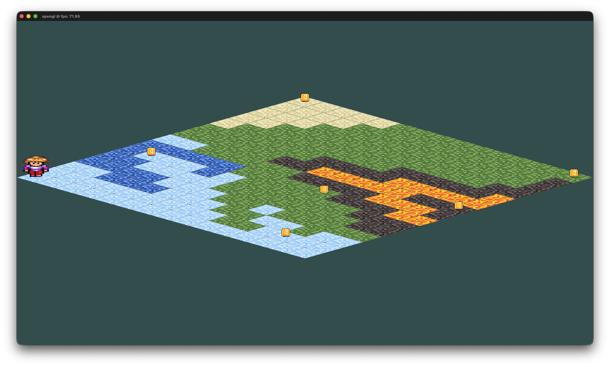

# GB

Rodar: ./ex

Compilar:  g++ -framework Cocoa -framework OpenGL -framework IOKit -o ex GB.cpp  stb_image.cpp gl_utils.cpp -I include -I/opt/homebrew/include /opt/homebrew/lib/libGlew.a /opt/homebrew/lib/libglfw3.a -I/opt/homebrew/Cellar/glfw/3.4/include/

Andar por: W A S D Q E Z C

Não pode andar na agua
Morre no fogo (menos nos secretos)
Ganha ao pegar todas moedas.

Foto base:

Tiles secretos:
